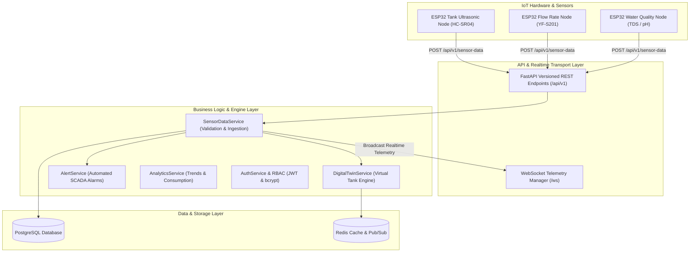
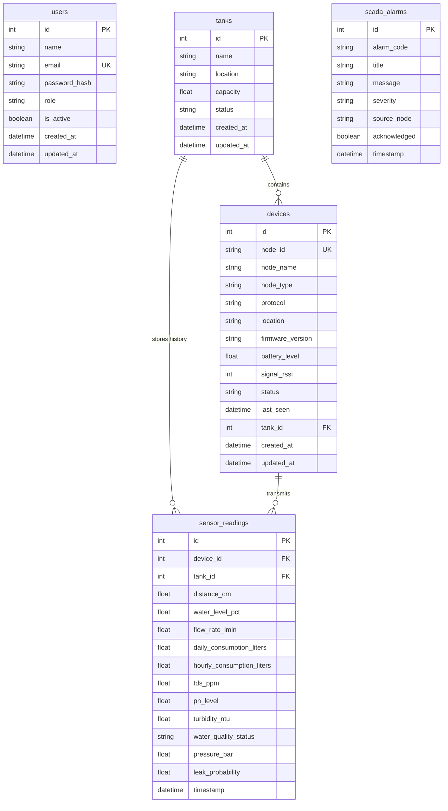

# AI-Powered Rural Water Infrastructure Monitoring & Digital Twin Platform — Enterprise Backend (`AquaSage`)

Production-grade, scalable **FastAPI** backend architecture built with **Python 3.12+**, **PostgreSQL**, **SQLAlchemy 2.0 Async**, **Alembic**, **Redis**, **WebSockets**, and strict **Clean Architecture**, **Repository Pattern**, and **Service Layer Pattern**.

---

## 🌐 Network Host & System IP Configuration

- **System IP Address**: `10.10.32.35`
- **Backend API Base URL**: `http://10.10.32.35:8000/api/v1`
- **Backend WebSocket Stream**: `ws://10.10.32.35:8000/ws`
- **Interactive Swagger UI**: `http://10.10.32.35:8000/docs`
- **ReDoc API Specifications**: `http://10.10.32.35:8000/redoc`

---

## 🏗️ System Architecture



---

## 🗄️ Database ER Diagram



---

## 🚀 Complete Features Implemented

### 1. Enterprise Foundation (Phase 1)
- **Clean Architecture & Separation of Concerns**: Strict decoupling across API Controllers (`app/api/v1`), Business Services (`app/services`), Repositories (`app/repositories`), SQLAlchemy Models (`app/models`), and Pydantic V2 Schemas (`app/schemas`).
- **SQLAlchemy 2.0 Async & PostgreSQL**: Full async database access via `asyncpg` with fallback to `sqlite+aiosqlite` for local dev.
- **Alembic Database Migrations**: Version-controlled migrations (`001_initial_schema` and `002_phase2_iot_digital_twin`).
- **JWT Authentication & Passwords**: OAuth2 bearer access & refresh tokens, password hashing with `bcrypt`.
- **Role-Based Access Control (RBAC)**: Fine-grained authorization for `Admin`, `Operator`, `Engineer`, and `Viewer` roles.
- **Health & Monitoring**:
  - `GET /api/v1/health`: Live health status checking PostgreSQL & Redis connectivity.
  - `GET /api/v1/system/status`: Real-time system performance metrics (CPU, RAM usage, Uptime).
- **Middleware**: CORS, Request Logging, Execution Time Tracking (`X-Process-Time` header), and Rate Limiting.
- **Global Error Handling**: Standardized JSON responses for all HTTP, validation, and domain errors (`{"success": false, "message": "..."}`).

### 2. IoT Sensor Data Ingestion & Devices (Phase 2)
- **Device Management**:
  - `POST /api/v1/devices/register`: Register new IoT Sensor Nodes (HC-SR04, YF-S201, TDS) or Gateways.
  - `GET /api/v1/devices`: List all registered nodes.
  - `GET /api/v1/devices/{id}`: Fetch single device metadata.
  - `PATCH /api/v1/devices/{id}`: Update device state, location, or firmware version.
- **Sensor Data Ingestion & Validation**:
  - `POST /api/v1/sensor-data`: Ingest ultrasonic distance (HC-SR04), flow rate/consumption (YF-S201), and water quality (TDS/pH/Turbidity).
  - Validation rules: Rejects invalid TDS (<0 or >5000 ppm), negative water levels (<0), and negative flow rates (<0).
  - Automatic quality classification (`Safe` vs `Unsafe` based on TDS <500 ppm and pH 6.5–8.5).
  - `GET /api/v1/sensor-data/latest`: Returns real-time telemetry payload formatted to directly feed the frontend `useTelemetryStore` Zustand store.

### 3. Digital Twin Engine
- `GET /api/v1/digital-twin/{tank_id}`: Generates live virtual model of water tanks detailing current level %, volume in Liters, inflow/outflow balance, hydraulic pressure in Bar, water quality status, pump health score %, and AI leak probabilities.

### 4. SCADA Alert Engine
- `GET /api/v1/alerts`: Returns active and historical SCADA alarms matching frontend `SCADAAlarm` interface.
- `POST /api/v1/alerts/{id}/acknowledge`: Acknowledges alarms by ID.
- Automated alert triggers: Low water level (<20%), unsafe water quality (TDS >500 ppm), and leak anomalies (>50%).

### 5. Analytics Foundation
- `GET /api/v1/analytics/consumption`: Daily, weekly, and monthly water consumption metrics.
- `GET /api/v1/analytics/water-quality-trends`: Historical TDS, pH, and turbidity data points.
- `GET /api/v1/analytics/tank-trends/{tank_id}`: Historical storage level % trends.

### 6. Real-Time WebSockets (`/ws`)
- Broadcasts live telemetry updates matching the frontend `socketService.ts` and `useTelemetryStore` state.

---

## 📁 Repository Directory Structure

```
backend/
├── app/
│   ├── api/
│   │   ├── deps.py               # Dependency Injection Container (Auth, Roles, DB, Repos, Services)
│   │   └── v1/
│   │       ├── api.py            # V1 Router Aggregator
│   │       ├── auth.py           # Login, Refresh Token, Profile endpoints
│   │       ├── health.py         # DB & Redis connection health check
│   │       ├── system.py         # System CPU, RAM, and Uptime metrics
│   │       ├── users.py          # User management with RBAC
│   │       ├── tanks.py          # Storage tank CRUD endpoints
│   │       ├── sensor_nodes.py   # Legacy sensor nodes
│   │       ├── devices.py        # IoT Device Nodes & Gateway management
│   │       ├── sensor_data.py    # IoT Sensor Data Ingestion & Latest Telemetry
│   │       ├── digital_twin.py   # Virtual Digital Twin Engine
│   │       ├── alerts.py         # SCADA Alerts & Acknowledgments
│   │       ├── analytics.py      # Historical consumption & trend charts
│   │       └── websocket.py      # Real-time WebSocket streaming (/ws)
│   ├── core/
│   │   ├── config.py             # App & environment configuration
│   │   ├── security.py           # Password hashing & JWT token functions
│   │   ├── roles.py              # Role Enum & hierarchy definitions
│   │   ├── logging.py            # Structured enterprise logger
│   │   └── exceptions.py         # Custom exceptions & global handlers
│   ├── database/
│   │   ├── base.py               # SQLAlchemy 2.0 Base & timestamp mixins
│   │   ├── session.py            # Async engine & sessionmaker
│   │   ├── database.py           # DB exports
│   │   └── redis.py              # Redis client & cache layer
│   ├── models/
│   │   ├── user.py               # User model
│   │   ├── tank.py               # Tank model
│   │   ├── sensor_node.py        # SensorNode model
│   │   ├── device.py            # DeviceNode model
│   │   ├── sensor_reading.py    # SensorReading model
│   │   └── alert.py             # SCADAAlarmModel model
│   ├── schemas/
│   │   ├── common.py             # StandardResponse & Pagination DTOs
│   │   ├── auth.py               # Auth DTOs
│   │   ├── user.py               # User DTOs
│   │   ├── tank.py               # Tank DTOs
│   │   ├── sensor_node.py        # SensorNode DTOs
│   │   ├── device.py            # Device DTOs
│   │   ├── sensor_data.py        # Telemetry Ingestion DTOs
│   │   ├── digital_twin.py       # Digital Twin DTOs
│   │   ├── alert.py             # SCADA Alert DTOs
│   │   ├── analytics.py          # Analytics DTOs
│   │   └── health.py             # Health check DTOs
│   ├── repositories/
│   │   ├── base.py               # Generic Async BaseRepository
│   │   ├── user.py               # UserRepository
│   │   ├── tank.py               # TankRepository
│   │   ├── sensor_node.py        # SensorNodeRepository
│   │   ├── device.py            # DeviceRepository
│   │   ├── sensor_reading.py    # SensorReadingRepository
│   │   └── alert.py             # AlertRepository
│   ├── services/
│   │   ├── auth.py               # AuthService
│   │   ├── user.py               # UserService
│   │   ├── tank.py               # TankService
│   │   ├── sensor_node.py        # SensorNodeService
│   │   ├── health.py             # HealthService
│   │   ├── device.py            # DeviceService
│   │   ├── sensor_data.py        # SensorDataService
│   │   ├── digital_twin.py       # DigitalTwinService
│   │   ├── alert.py             # AlertService
│   │   └── analytics.py          # AnalyticsService
│   ├── websocket/
│   │   └── manager.py            # ConnectionManager
│   ├── middleware/
│   │   ├── logging.py            # Request logger & execution timer
│   │   └── rate_limit.py         # Rate limiting middleware
│   ├── utils/
│   │   └── datetime.py           # UTC time helpers
│   └── main.py                   # FastAPI Application entrypoint
├── alembic/                      # Database migrations
│   ├── env.py
│   └── versions/
│       ├── 001_initial_schema.py
│       └── 002_phase2_iot_digital_twin.py
├── tests/                        # Automated Pytest suite
│   ├── conftest.py
│   ├── test_health.py
│   ├── test_auth.py
│   ├── test_users.py
│   ├── test_tanks.py
│   ├── test_devices.py
│   ├── test_sensor_ingestion.py
│   ├── test_digital_twin.py
│   └── test_alerts.py
├── .env.example
├── .env
├── alembic.ini
├── Dockerfile
├── docker-compose.yml
├── pytest.ini
└── requirements.txt
```

---

## 🔐 Role-Based Access Control (RBAC) Matrix

| Endpoint | Method | Required Role | Purpose |
| :--- | :--- | :--- | :--- |
| `/api/v1/auth/login` | `POST` | Public | Login & issue access/refresh tokens |
| `/api/v1/auth/refresh` | `POST` | Public | Refresh JWT access token |
| `/api/v1/auth/me` | `GET` | Authenticated | Get logged-in user profile |
| `/api/v1/health` | `GET` | Public | PostgreSQL & Redis health check |
| `/api/v1/system/status` | `GET` | Public | System performance metrics |
| `/api/v1/users` | `POST` | `Admin` | Create new user account |
| `/api/v1/users` | `GET` | `Admin`, `Operator` | List all user accounts |
| `/api/v1/tanks` | `POST` | `Admin`, `Engineer` | Create water storage tank |
| `/api/v1/tanks` | `GET` | Authenticated | List all water storage tanks |
| `/api/v1/devices/register` | `POST` | `Admin`, `Engineer` | Register IoT sensor node |
| `/api/v1/devices` | `GET` | Authenticated | List all registered IoT devices |
| `/api/v1/sensor-data` | `POST` | Public / Node | Ingest HC-SR04, YF-S201, TDS telemetry |
| `/api/v1/sensor-data/latest` | `GET` | Public | Get latest frontend Zustand telemetry |
| `/api/v1/digital-twin/{id}` | `GET` | Public | Virtual digital twin state |
| `/api/v1/alerts` | `GET` | Public | List active SCADA alerts |
| `/api/v1/alerts/{id}/acknowledge` | `POST` | Public | Acknowledge alarm |
| `/api/v1/analytics/consumption` | `GET` | Public | Consumption analytics |

---

## 🛠️ Step-by-Step Local Setup & Run Guide

### 1. Prerequisites
- Python 3.12+
- PostgreSQL (or local SQLite fallback)
- Redis

### 2. Environment Setup
```bash
cd backend

# Create virtual environment
python -m venv venv

# Activate Virtual Environment (Windows PowerShell):
.\venv\Scripts\Activate.ps1

# Activate Virtual Environment (Linux / macOS):
source venv/bin/activate

# Install Dependencies:
pip install -r requirements.txt
```

### 3. Database Migrations
```bash
# Apply migrations using venv binary
.\venv\Scripts\alembic.exe upgrade head
```

### 4. Run Development Server
```bash
# Start Uvicorn bound to 0.0.0.0:8000
uvicorn app.main:app --reload --host 0.0.0.0 --port 8000
```

### 5. Access Interactive Documentation
Open browser at: `http://10.10.32.35:8000/docs` or `http://localhost:8000/docs`.

---

## 🧪 Running Automated Tests

Run the complete Pytest test suite (100% pass rate):

```bash
.\venv\Scripts\python.exe -m pytest -v
```

Verification Output:
```text
tests/test_alerts.py::test_scada_alerts_and_acknowledgment PASSED        [  8%]
tests/test_auth.py::test_login_success PASSED                            [ 16%]
tests/test_auth.py::test_login_invalid_password PASSED                   [ 25%]
tests/test_auth.py::test_get_current_user_profile PASSED                 [ 33%]
tests/test_auth.py::test_refresh_token PASSED                            [ 41%]
tests/test_digital_twin.py::test_digital_twin_endpoint PASSED            [ 50%]
tests/test_health.py::test_health_check PASSED                           [ 58%]
tests/test_health.py::test_system_status PASSED                          [ 66%]
tests/test_sensor_ingestion.py::test_sensor_ingestion_and_validation PASSED [ 75%]
tests/test_tanks.py::test_tank_and_sensor_node_workflow PASSED           [ 83%]
tests/test_users.py::test_admin_can_create_user PASSED                   [ 91%]
tests/test_users.py::test_viewer_cannot_create_user PASSED               [100%]

======================== 12 passed in 9.45s ========================
```

---

## 🐳 Docker Deployment

Run full stack (PostgreSQL 16 + Redis 7 + AquaSage API) via Docker Compose:

```bash
docker-compose up --build -d
```
